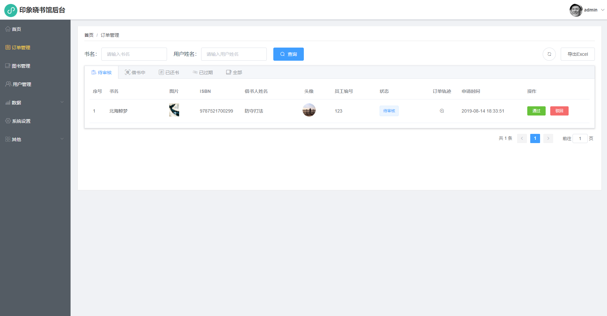
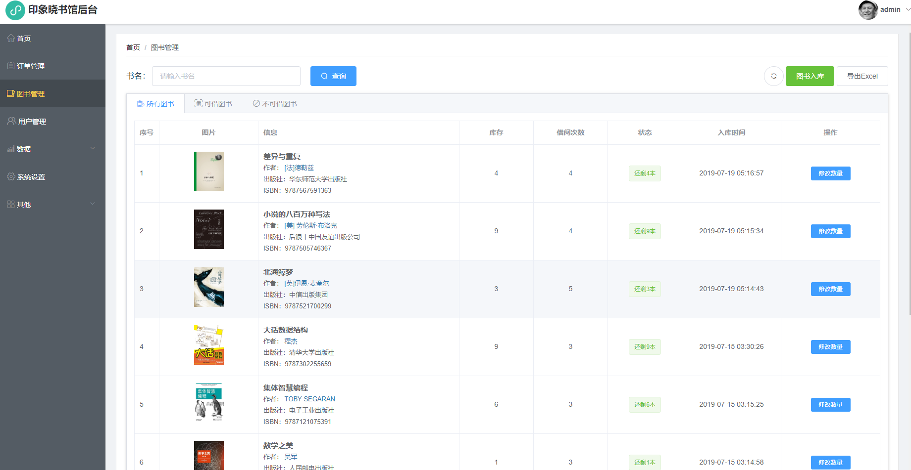
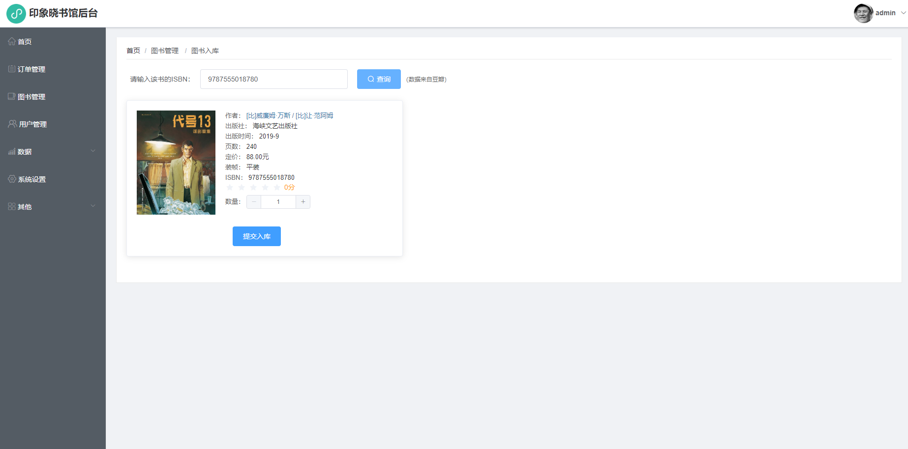
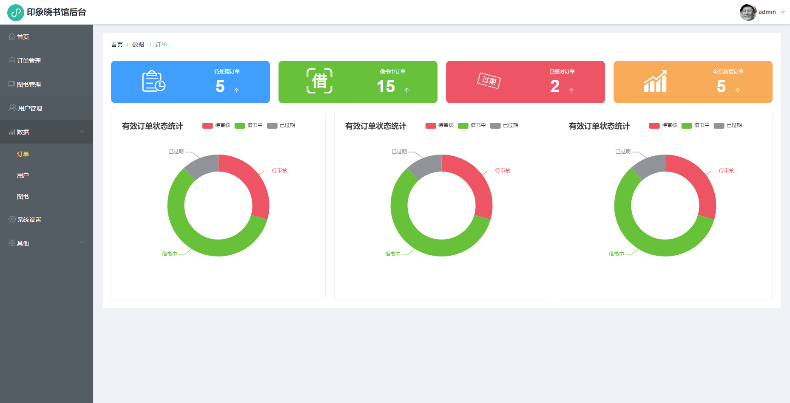

<!--
 * @Description: In User Settings Edit
 * @Author: your name
 * @Date: 2019-07-10 23:48:38
 * @LastEditTime: 2019-08-26 18:24:37
 * @LastEditors: Please set LastEditors
 -->
# book-admin

> A Vue.js project for book

<p>
  <a href="https://github.com/vuejs/vue">
    
  </a>
  <a href="https://github.com/vuejs/vuex">
    
  </a>
  <a href="https://github.com/ElemeFE/element">
    
  </a>
  <a href="https://github.com/axios/axios">
    
  </a>
  <a href="https://github.com/apache/incubator-echarts">
    
  </a>
  <a href="https://github.com/SheetJS/js-xlsx">
    
  </a>
</p>

book-admin 为图书小程序的pc管理端版本，使用vue全家桶，组件库采用的是element-ui库

### 预览地址

[https://book.jiazhuoyi.cn](https://book.jiazhuoyi.cn)


演示账户以及密码：

| 账号  | 密码  | 权限 |
| ----- | ----- | ----- |
| test | test | 系统用户，拥有审核用户，订单，图书入库等权限 |

### 系统特点：

1. RESTFul风格接口
2. 支持前端excel导出
3. 根据权限判断路由
4. jwt鉴权 

### 系统预览：










## Build Setup

``` bash
# install dependencies
npm install

# serve with hot reload at localhost:8080
npm run dev

# build for production with minification
npm run build

# build for production and view the bundle analyzer report
npm run build --report
```

For a detailed explanation on how things work, check out the [guide](http://vuejs-templates.github.io/webpack/) and [docs for vue-loader](http://vuejs.github.io/vue-loader).
